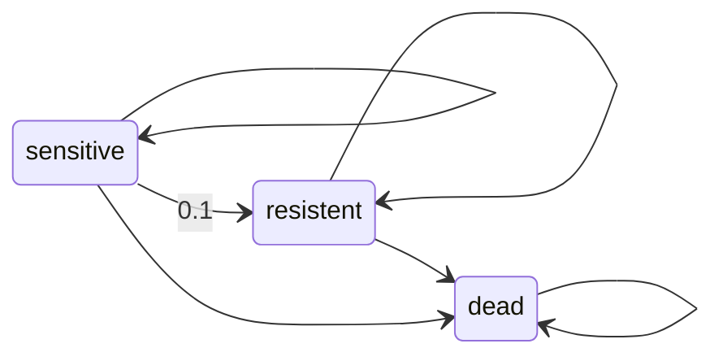

## What are Agent-Based Models (ABMs)?
Agent-based models (ABMs) are computational simulation models that represent complex systems through the interactions of individual entities, called "agents." These agents follow defined rules and behaviors, interacting with each other and their environment over time. ABMs are particularly useful for modeling systems with heterogeneous elements, emergent behaviors, and stochastic dynamics.

### Key Features of ABMs:

- **Agents:** Represent individual entities with attributes (e.g., cancer cells, immune cells, patients).
- **Rules:** Govern agent behaviors (e.g., proliferation, migration, apoptosis).
- **Environment:** The space where agents interact (e.g., tumor microenvironment).
- **Interactions:** Agents interact based on defined mechanisms (e.g., cell signaling, competition for resources).
- **Stochasticity:** Random events influence system evolution (e.g., mutations, drug resistance).

### Steps to Implement:

1. **Define Agents and States:** Map out the model structure. 
2. **Specify Transition Rules:** Define the likelihood of transitioning into another state.
3. **Set Up the Environment:** Define spatial structure or non-spatial interactions.
4. **Incorporate Stochasticity:** Introduce random factors.
5. **Simulation Execution:** Run simulations over time to observe emergent patterns.
. **Analysis and Visualization:** Use statistical tools and visualization libraries (e.g., Matplotlib, Gephi).

### Simple example scenario

**Scenario:**
- Simulating the growth of a heterogeneous tumor in response to chemotherapy.

**Agents:**

- Tumor cells (can be in different states: "sensitive," "resistant," or "dead")

Not included in simple model:
- Immune cells (attack tumor cells)
- Drug molecules (affect tumor cells)

**States and Transitions:**

- Sensitive cells → Become resistant due to mutations (probabilistic transition).
- Resistant cells → Survive treatment but might be targeted by immune cells.
- Dead cells → Removed from the environment.



**Environment:**
- A 2D lattice representing the tumor microenvironment where cells move and interact.

**Simulation Objectives:**

- Observe how tumors evolve resistance over time.
- Evaluate the effectiveness of combination therapies.
- Predict the likelihood of recurrence after treatment cessation.

**Key Insights Gained:**

- The role of spatial heterogeneity in treatment success.
- Potential timing for combination therapies to prevent resistance.
- How immune system dynamics influence tumor eradication.

### Implementation





```R
library(data.table)

# Develop the agent and the states
initialize_model <- function(initial_cells = 100) {
  cells <- data.table(id = 1:initial_cells, state = "sensitive")
  return(list(cells = cells, cycle = 0))
}

# Define the time course of the model
apply_chemotherapy <- function(model, chemo_kill_prob = 0.6, mutation_prob = 0.1) {
  model$cycle <- model$cycle + 1
  
  # Kill sensitive cells
  kill_ids <- model$cells[state == "sensitive" & runif(.N) < chemo_kill_prob, id]
  model$cells[id %in% kill_ids, state := "dead"]
  
  # Mutate some surviving sensitive cells to resistant
  mutate_ids <- model$cells[state == "sensitive" & runif(.N) < mutation_prob, id]
  model$cells[id %in% mutate_ids, state := "resistant"]
  
  return(model)
}

# Update the agent based on transition probabilities
model <- initialize_model()
results <- list()

for (i in 1:6) {
  model <- apply_chemotherapy(model)
  results[[i]] <- data.table(cycle = i, 
                              sensitive = sum(model$cells$state == "sensitive"),
                              resistant = sum(model$cells$state == "resistant"),
                              dead = sum(model$cells$state == "dead"))
}

results <- rbindlist(results)

# Visualize the results
ggplot(results, aes(x = cycle)) +
  geom_line(aes(y = sensitive, color = "Sensitive")) +
  geom_line(aes(y = resistant, color = "Resistant")) +
  geom_line(aes(y = dead, color = "Dead")) +
  labs(title = "Tumor Cell Dynamics Over Chemotherapy Cycles",
       x = "Chemotherapy Cycle", y = "Cell Count", color = "Cell Type") +
  theme_minimal()

```





```python
import numpy as np
import pandas as pd
import matplotlib.pyplot as plt

# Initialize model
def initialize_model(initial_cells=100):
    cells = pd.DataFrame({
        'id': np.arange(1, initial_cells + 1),
        'state': 'sensitive'
    })
    return {'cells': cells, 'cycle': 0}

# Apply chemotherapy
def apply_chemotherapy(model, chemo_kill_prob=0.6, mutation_prob=0.1):
    model['cycle'] += 1
    
    # Kill sensitive cells
    kill_mask = (model['cells']['state'] == 'sensitive') & (np.random.rand(len(model['cells'])) < chemo_kill_prob)
    model['cells'].loc[kill_mask, 'state'] = 'dead'
    
    # Mutate some surviving sensitive cells to resistant
    mutate_mask = (model['cells']['state'] == 'sensitive') & (np.random.rand(len(model['cells'])) < mutation_prob)
    model['cells'].loc[mutate_mask, 'state'] = 'resistant'
    
    return model

# Run the simulation
model = initialize_model()
results = []

for i in range(1, 7):
    model = apply_chemotherapy(model)
    results.append({
        'cycle': i,
        'sensitive': (model['cells']['state'] == 'sensitive').sum(),
        'resistant': (model['cells']['state'] == 'resistant').sum(),
        'dead': (model['cells']['state'] == 'dead').sum()
    })

results_df = pd.DataFrame(results)

# Visualize the results
plt.figure(figsize=(8, 5))
plt.plot(results_df['cycle'], results_df['sensitive'], label='Sensitive', marker='o')
plt.plot(results_df['cycle'], results_df['resistant'], label='Resistant', marker='s')
plt.plot(results_df['cycle'], results_df['dead'], label='Dead', marker='x')
plt.xlabel('Chemotherapy Cycle')
plt.ylabel('Cell Count')
plt.title('Tumor Cell Dynamics Over Chemotherapy Cycles')
plt.legend()
plt.grid()
plt.show()

```




The figure will look something like this:

```chartjs
{
  "type": "line",
  "data": {
    "labels": [
      "January",
      "February",
      "March",
      "April",
      "May",
      "June",
      "July"
    ],
    "datasets": [
      {
        "label": "# of bugs",
        "fill": false,
        "lineTension": 0.1,
        "backgroundColor": "rgba(75,192,192,0.4)",
        "borderColor": "rgba(75,192,192,1)",
        "borderCapStyle": "butt",
        "borderDash": [],
        "borderDashOffset": 0,
        "borderJoinStyle": "miter",
        "pointBorderColor": "rgba(75,192,192,1)",
        "pointBackgroundColor": "#fff",
        "pointBorderWidth": 1,
        "pointHoverRadius": 5,
        "pointHoverBackgroundColor": "rgba(75,192,192,1)",
        "pointHoverBorderColor": "rgba(220,220,220,1)",
        "pointHoverBorderWidth": 2,
        "pointRadius": 1,
        "pointHitRadius": 10,
        "data": [
          65,
          59,
          80,
          81,
          56,
          55,
          40
        ],
        "spanGaps": false
      },
      {
        "label": "# of bugs",
        "fill": false,
        "lineTension": 0.1,
        "backgroundColor": "rgba(75,192,192,0.4)",
        "borderColor": "rgba(75,192,192,1)",
        "borderCapStyle": "butt",
        "borderDash": [],
        "borderDashOffset": 0,
        "borderJoinStyle": "miter",
        "pointBorderColor": "rgba(75,192,192,1)",
        "pointBackgroundColor": "#fff",
        "pointBorderWidth": 1,
        "pointHoverRadius": 5,
        "pointHoverBackgroundColor": "rgba(75,192,192,1)",
        "pointHoverBorderColor": "rgba(220,220,220,1)",
        "pointHoverBorderWidth": 2,
        "pointRadius": 1,
        "pointHitRadius": 10,
        "data": [
          165,
          159,
          180,
          181,
          156,
          155,
          140
        ],
        "spanGaps": false
      }
    ]
  },
  "options": {}
}
```


<!-- ```chartjs
{
  "type": "line",
  "data": {
    "labels": [
      "Cycle 1",
      "Cycle 2",
      "Cycle 3",
      "Cycle 4",
      "Cycle 5",
      "Cycle 6"
    ],
    "datasets": [
      {
        "label": "Sensitive cells",
        "fill": false,
        "lineTension": 0.1,
        "backgroundColor": "rgba(54, 162, 235,0.4)",
        "borderColor": "rgba(54, 162, 235,1)",
        "borderCapStyle": "butt",
        "borderDash": [],
        "borderDashOffset": 0,
        "borderJoinStyle": "miter",
        "pointBorderColor": "rgba(54, 162, 235,1)",
        "pointBackgroundColor": "#fff",
        "pointBorderWidth": 1,
        "pointHoverRadius": 5,
        "pointHoverBackgroundColor": "rgba(54, 162, 235,1)",
        "pointHoverBorderColor": "rgba(220,220,220,1)",
        "pointHoverBorderWidth": 2,
        "pointRadius": 1,
        "pointHitRadius": 10,
        "data": [
          33,
          10,
          2,
          0,
          0,
          0
        ],
        "spanGaps": false
      },
      {
        "label": "Resistant cells",
        "fill": false,
        "lineTension": 0.1,
        "backgroundColor": "rgba(255, 205, 86,0.4)",
        "borderColor": "rgba(255, 205, 86,1)",
        "borderCapStyle": "butt",
        "borderDash": [],
        "borderDashOffset": 0,
        "borderJoinStyle": "miter",
        "pointBorderColor": "rgba(255, 205, 86,1)",
        "pointBackgroundColor": "#fff",
        "pointBorderWidth": 1,
        "pointHoverRadius": 5,
        "pointHoverBackgroundColor": "rgba(255, 205, 86,1)",
        "pointHoverBorderColor": "rgba(220,220,220,1)",
        "pointHoverBorderWidth": 2,
        "pointRadius": 1,
        "pointHitRadius": 10,
        "data": [
            5,6,6,6,6,6
        ],
        "spanGaps": false
      },
      ,
      {
        "label": "Dead cells",
        "fill": false,
        "lineTension": 0.1,
        "backgroundColor": "rgba(255, 99, 132,0.4)",
        "borderColor": "rgba(255, 99, 132,1)",
        "borderCapStyle": "butt",
        "borderDash": [],
        "borderDashOffset": 0,
        "borderJoinStyle": "miter",
        "pointBorderColor": "rgba(255, 99, 132,1)",
        "pointBackgroundColor": "#fff",
        "pointBorderWidth": 1,
        "pointHoverRadius": 5,
        "pointHoverBackgroundColor": "rgba(255, 99, 132,1)",
        "pointHoverBorderColor": "rgba(220,220,220,1)",
        "pointHoverBorderWidth": 2,
        "pointRadius": 1,
        "pointHitRadius": 10,
        "data": [
            62,84,92,94,94,94
        ],
        "spanGaps": false
      }
    ]
  },
  "options": {}
}
``` -->


### Advantages of ABMs
- Captures Complexity: Represents heterogeneous cancer cell behavior.
- Personalized Insights: Simulates patient-specific scenarios.
- Exploration of Rare Events: Tests unlikely but possible outcomes.
- Hypothesis Testing: Evaluates treatment strategies before clinical trials.

### Challenges of ABMs
- Computational Cost: Large-scale simulations require high resources.
- Model Validation: Requires experimental data for accuracy.
- Parameter Uncertainty: Difficult to determine precise transition probabilities.